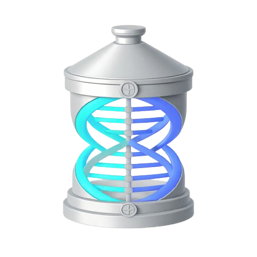

  

# PyxPass

PyxPass is a fork of KeePassXC that reimagines password management for the
decentralized web. Instead of saving an offline KDBX file, every password entry
is individually encrypted and stored as a document on the Dash Platform — a
self-governing, decentralized data layer backed by Dash's masternode network.

There is no local database file. No centralized cloud. Your vault lives on-chain,
encrypted end-to-end, and is accessible from any device that holds your master
password.

---

## Why PyxPass?

KeePassXC is outstanding at one thing: keeping your passwords encrypted and
local. But a local file is tethered to one machine. Cloud synced folders solve
that by handing your file to a third party.

PyxPass splits the difference the right way:

- **Encrypted end-to-end.** Each entry is encrypted with AES-256-GCM using a key
  derived from your master password. Only ciphertext ever reaches the network.
- **Self-custody.** There is no server, no account, no company holding your data.
  You hold the keys. The Dash Platform simply stores opaque, encrypted documents.
- **Per-entry, not per-file.** Each entry is its own document, so updating one
  password rewrites only that entry — not your whole vault.
- **Multi-device by design.** Unlock on any machine: PyxPass pulls your encrypted
  entries from Platform, decrypts locally, and builds your vault in memory.

PyxPass keeps the KeePassXC experience you know — groups, search, a password
generator, TOTP, browser integration — and swaps the storage backend for a
decentralized one you control.

---

## How it works

1. You unlock PyxPass with your master password.
2. The app derives a master key (Argon2id) and pulls your encrypted entries from
   the Dash Platform.
3. Entries decrypt locally and appear in your vault.
4. When you add, edit, or delete an entry, only that single document is
   created, replaced, or deleted on Platform.

On-chain history is disabled. Per-entry version history is kept in memory,
so frequent password changes stay effectively free — Dash Platform returns a
storage refund when replaced bytes leave its state.

---

## Features

### Core

- Create, open, and manage password entries stored as encrypted documents on
  Dash Platform
- End-to-end encryption with AES-256-GCM and per-entry derived keys
- Entries organized into groups
- Password generator
- Search for entries
- TOTP storage and generation
- Auto-Type passwords into applications
- Browser integration for Chrome, Firefox, Edge, Chromium, Vivaldi, Brave, and
  Tor Browser
- Multi-device access — unlock on any machine, no file to copy around
- Import from KDBX (seed once), CSV, 1Password, Bitwarden, and KeePass1 formats

### Advanced

- Per-entry key derivation and independent key rotation
- Database reports (password health, HIBP, statistics)
- Field references between entries
- Entry history (kept locally in memory)
- Command line interface (pyxpass-cli)
- SSH Agent integration
- FreeDesktop.org Secret Service integration

---

## Getting Started

> PyxPass currently targets **testnet**. It does not spend real Dash without
> explicit confirmation.

1. Clone and build PyxPass (see [Building](#building)).
2. Start the Node.js sidecar, which connects to the Dash Platform testnet.
3. Create a testnet identity and register the PyxPass data contract.
4. Unlock PyxPass with a master password and start adding entries.

Detailed setup is in the [User Guide].

---

## Building

PyxPass is split into two parts:

- **The KeePassXC fork** — C++/Qt, builds like upstream KeePassXC.
- **The sidecar** — a Node.js daemon (`sidecar/`) that owns Dash identity keys,
  performs DAPI calls, and handles encryption.

Build instructions for the C++ application are in the [Build and Install page]
and in the [Wiki].

---

## Contributing

We welcome contributions. Please read the [CONTRIBUTING] document and follow the
project's [Code of Conduct].

---

## License

PyxPass is a fork of KeePassXC. KeePassXC code is licensed under GPL-2 or GPL-3;
additional third-party file licensing is detailed in [COPYING].
